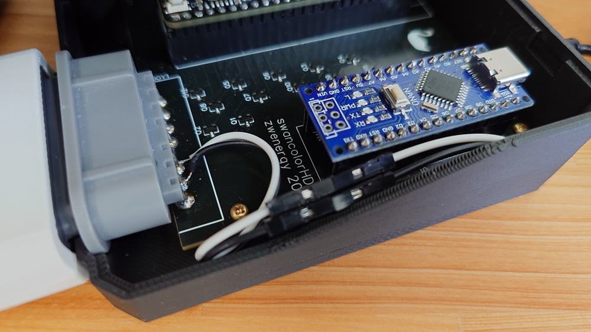
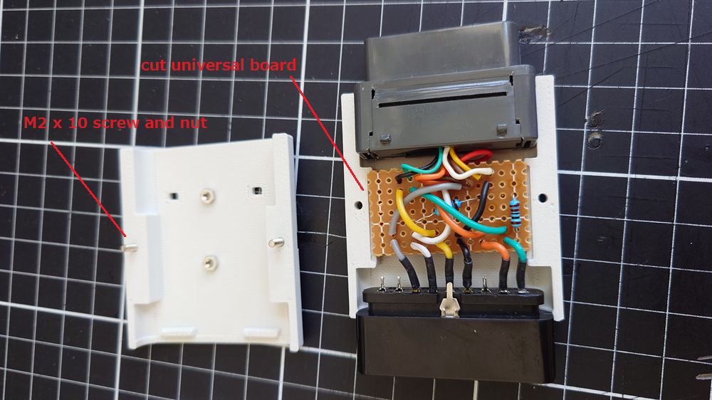
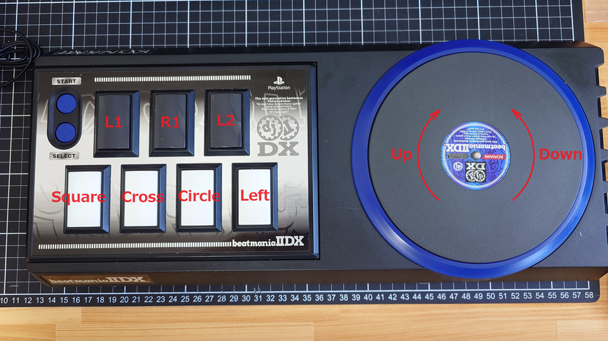
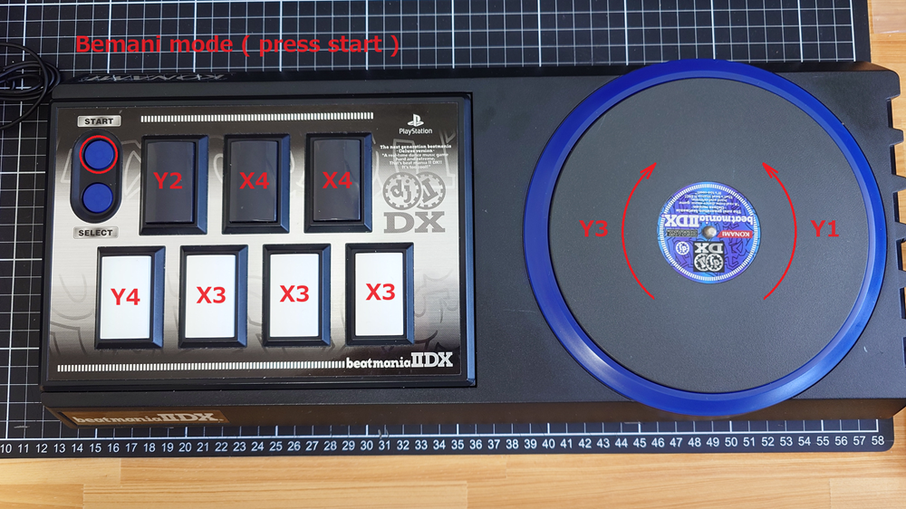

# controller4ps2
Flashing controller4ps2.ino to Arduino, you can control swancolorHD with a Playstation(2) controller.  
You can use it by connecting the "PS2 male controller connector" to the "SNES female controller connector" according to the [schematic](./controller4ps2_schematic.pdf).  

## key mapping
| PS2 Button | WS Button| WS Button (Rotated) |
|----|----|----|
|UP | X1 | Y2 |
|DOWN | X3 | Y4 |
|LEFT | X4 | Y1 |
|RIGHT | X2 | Y3 |
|Circle | A | X3 |
|Cross | B | X4 |
|Triangle | A | X2 |
|Square | B | X1 |
|L1 | Y1 | B |
|R1 | Y2 | A |
|L2 | Y4 | - |
|R2 | Y3 | - |
|START | START | START |

## Bemani mode
Enable/disable "Bemani mode" using the button combination below.  
**L1 + R1 + Cross + Square + START**  

"Bemani mode" is for operating **beatmania for WonderSwan** with the Playstation beatmania(IIDX) Controller.  
Playstation beatmani IIDX Controller  
https://www.konamistyle.jp/products/detail.php?product_id=19964

## key mapping ( Bemani controller )
Since the number of buttons on the "beatmani IIDX Controller" is fewer than that of the WonderSwan, I set it so that I could switch operations using the START button.  

When playing a music, do not press the START button.  

  
When selecting a menu, press and hold the START button.  
